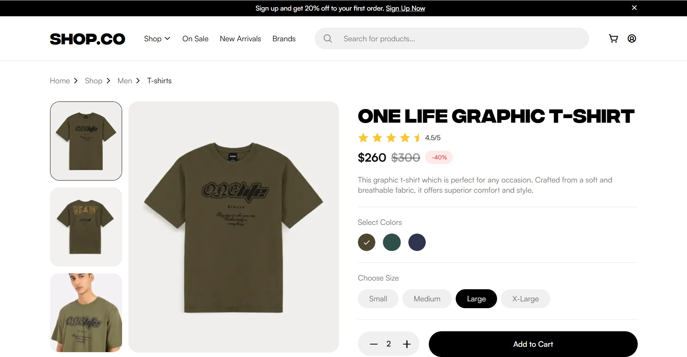
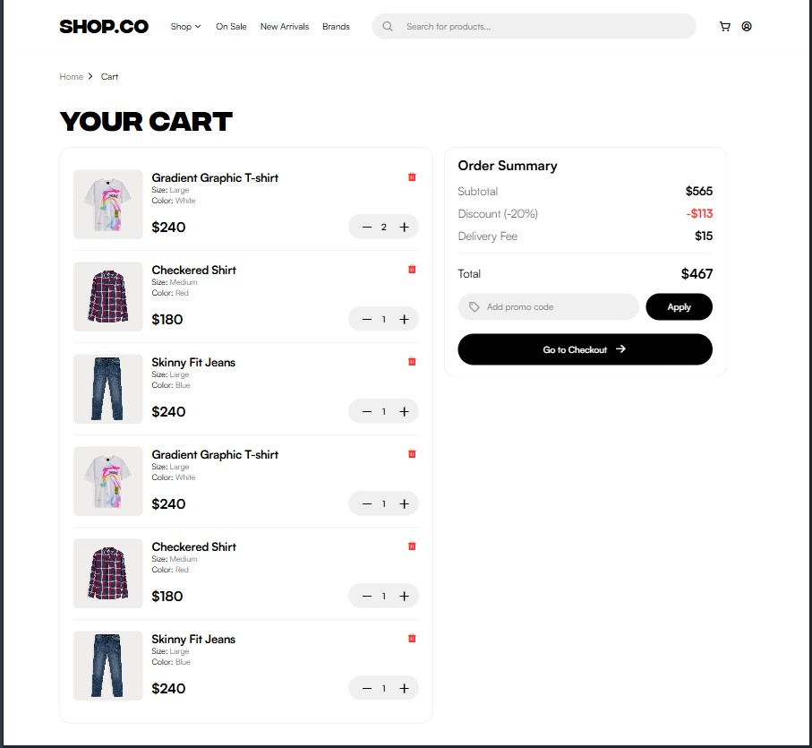
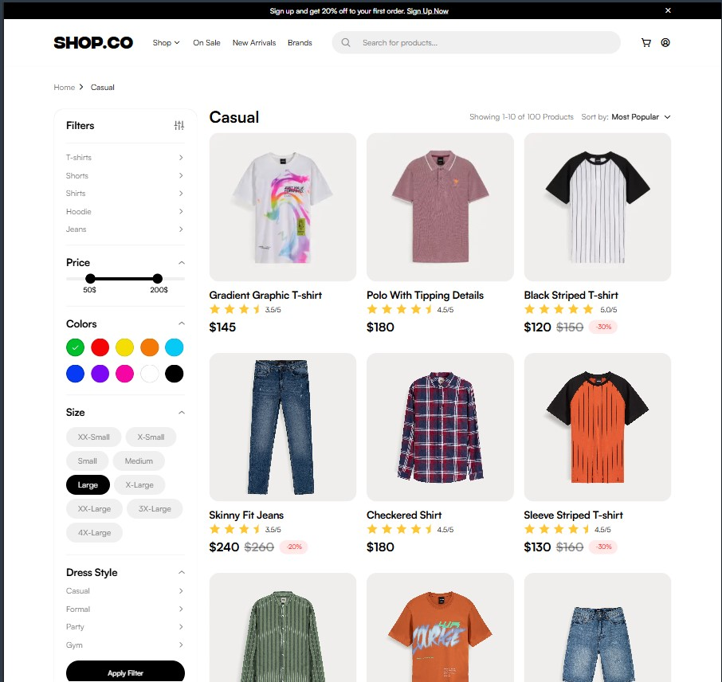

# Shop.co — Clothing Store Demo

A front-end demo of an online clothing store, created as a portfolio project. The layout was implemented from a Figma mockup using HTML, CSS and JavaScript.

🔗 **Demo:** https://zhuridochka.github.io/Shop.co-show/category.html

## Screenshots
| 
| 
| 

## Features
- Home page with featured collections and offers
- Category page with a product listing
- Product page with item details
- Shopping cart page
- Custom fonts and optimized images

## Project structure
- `index.html`, `home.html` — entry and home pages
- `category.html` — product catalog
- `product.html` — product details
- `cart.html` — shopping cart
- `common.html` — shared page elements
- `css/` — styles
- `js/` — scripts
- `fonts/`, `img/` — fonts and images

## Tech stack
- HTML5
- CSS3
- JavaScript

## Run locally
Clone the repository and open `index.html` in your browser.

## Notes
This is a demo project for portfolio purposes. Products and content are for demonstration only; there is no real backend or payment processing.
